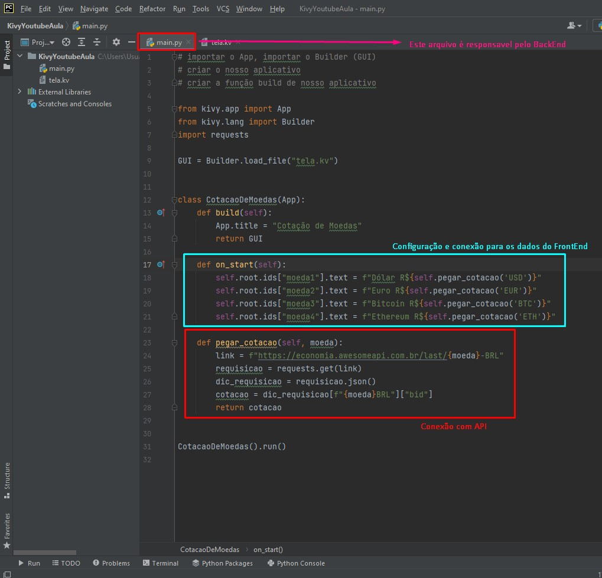
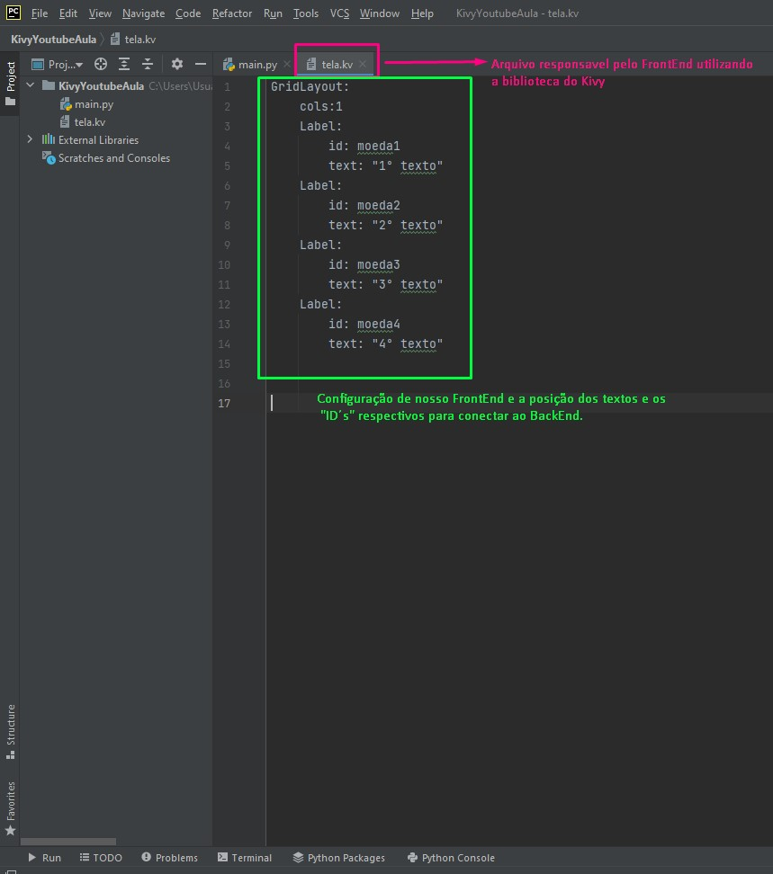
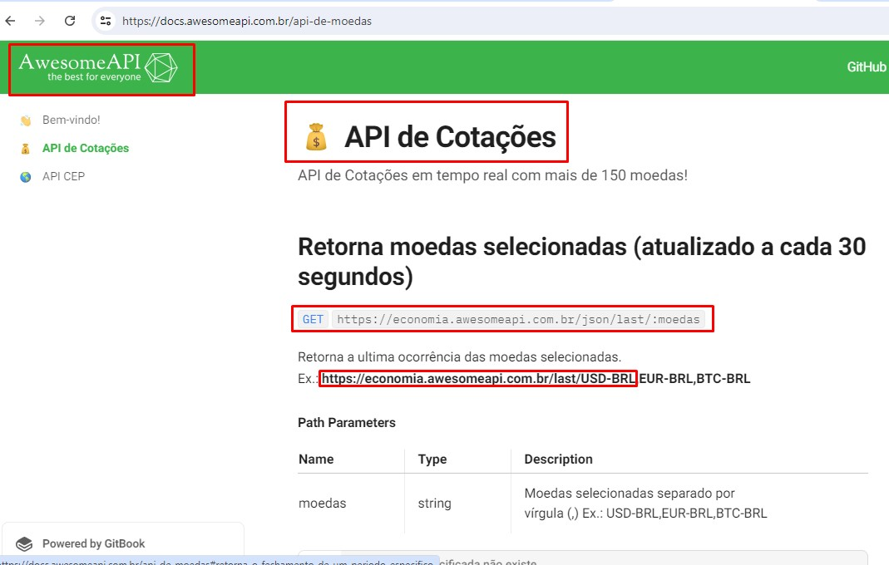

# Currency Quote APP Python Project
 A criação de um APP de Cotação de Moedas com Python, e utilizando sua biblioteca Kivy.

# Sobre o projeto

Este projeto aborda a criação de aplicativos e programas com Python construído a partir do modelo da aula **Como Criar Aplicativos e Programas com Python - Introdução ao Kivy**, este trabalho contido no youtube, e organizado pelo canal [HastagProgramação](https://www.youtube.com/watch?v=NkBcU8biV4s&list=LL&index=8).

O aplicativo consiste em um projeto Python, que retorna informações da internet através de uma API, com o uso da categoria (GET) para listagem dos dados vindos da internet a partir do site (https://docs.awesomeapi.com.br/api-de-moedas), sendo responsavel pela cotação das moedas e esta API retorna a informação da cotação de uma determinadada moeda (Bitcoin, Ethereum, Dollar, Euro e etc...).
O BackEnd foi realizado em linguagem Python a partir do arquivo Main.py, e o FronEnd com seu arquivo tela.kv realizado também em linguagem Python com uso da biblioteca Kivy.

## Tela FrontEnd

## Arquivo BackEnd

## Arquivo FrontEnd

## Site de origem da API

# Tecnologias utilizadas
## Back end
- Python

## Front end
- Python 
- Kivy (Biblioteca Python)

# Interpretador / depurador utilizado (Python)
- Pycharm

# Autor

Carlos de Camargo Penteado Neto

[https://www.linkedin.com/in/carlos-de-camargo-penteado-neto-83974430]

